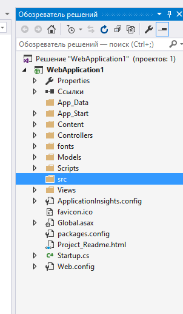
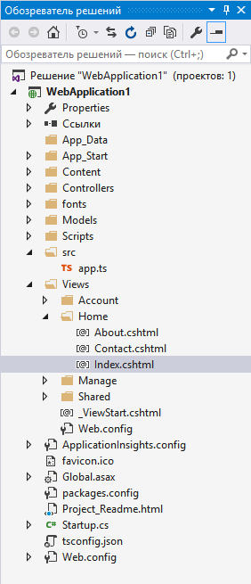

# Настройка

## Установка TypeScript

Если в вашей версии Visual Studio нет TypeScript, его можно установить для [Visual Studio 2015](http://www.microsoft.com/en-us/download/details.aspx?id=48593) или [Visual Studio 2013](https://www.microsoft.com/en-us/download/details.aspx?id=48739).
В данном руководстве используется Visual Studio 2015.

## Создание нового проекта

1. Выберите **Файл** (**File**)
2. Выберите **Создать проект** (**New Project**)
3. Выберите **Visual C#**
4. Выберите **ASP.NET Web Application**

   

5. Выберите **MVC**

    Флажок "Разместить в облаке" ("Host in the cloud") здесь снят, так как это пример локального проекта.
    

Запустите приложение, и убедитесь, что оно работает.

# Добавление TypeScript

Следующий шаг — добавить папку для TypeScript.


Назовем ее `src`.



## Добавление кода TypeScript

Щелкните правой кнопкой на `src` и выберите **Создать элемент** (**New Item**).
Затем выберите **Файл TypeScript** (**TypeScript File**), и назовите файл `app.ts`.


## Добавление кода примера

Введите следующий код в `app.ts`.

```ts
function sayHello() {
    const compiler = (document.getElementById("compiler") as HTMLInputElement).value;
    const framework = (document.getElementById("framework") as HTMLInputElement).value;
    return `Привет от ${compiler} и ${framework}!`;
}
```

## Настройка сборки

Щелкните правой кнопкой мыши на проекте и выберите **Создать элемент** (**New Item**).
Затем выберите **Файл конфигурации TypeScript** (**TypeScript Configuration File**), и используйте имя по умолчанию `tsconfig.json`.


Замените содержимое файла `tsconfig.json`, которое было по умолчанию, на следующее:

```json
{
  "compilerOptions": {
    "noImplicitAny": true,
    "noEmitOnError": true,
    "sourceMap": true,
    "target": "es5",
    "outDir": "./Scripts/App"
  },
  "files": [
    "./src/app.ts"
  ],
  "compileOnSave": true
}
```

Это похоже на то, что было по умолчанию, но отличается следующим:

1. Устанавливается `"noImplicitAny": true`.
2. Указывается выходная директория `"outDir": "./Scripts/App"`.
3. Явно перечисляются входные файлы в `"files"`, не полагаясь на `"excludes"`.
4. Устанавливается `"compileOnSave": true`.

Указывать `"noImplicitAny"` — неплохая идея, если вы пишете новый код; это поможет удостовериться, что вы по ошибке не напишете нетипизированный код.
`"compileOnSave"` упрощает обновление кода в запущенном веб-приложении.
См. [документацию на tsconfig.json](../tsconfig.json.md) для большей информации.

## Вызов скрипта из вида

1. В **Обозревателе решений** (**Solution Explorer**), откройте **Views** | **Home** | `Index.cshtml`.

   

2. Замените код на следующий:

   ```html
   @{
       ViewBag.Title = "Домашняя страница";
   }
   <script src="~/Scripts/App/app.js"></script>
   <div id="message"></div>
   <div>
       Компилятор: <input id="compiler" value="TypeScript" onkeyup="document.getElementById('message').innerText = sayHello()" /><br />
       Фреймворк: <input id="framework" value="ASP.NET" onkeyup="document.getElementById('message').innerText = sayHello()" />
   </div>
   ```

## Тестирование

1. Запустите проект.
2. Вы должны увидеть сообщение при заполнении полей ввода:


## Отладка

1. Нажмите F12 в браузере Edge и выберите вкладку **Отладчик** (**Debugger**).
2. Откройте первую папку `localhost`, затем `src/app.ts`.
3. Поставьте точку останова на строку с `return`.
4. Заполните поля ввода и убедитесь, что точка останова срабатывает на TypeScript-коде, и все работает правильно.


Это все, что нужно знать, чтобы применить TypeScript в проекте ASP.NET.
Дальше мы задействуем Angular и напишем простое приложение для этого фреймворка.

# Добавление Angular 2

## Загрузка зависимостей из NPM

1. Установите [PackageInstaller](https://github.com/madskristensen/PackageInstaller).

2. С помощью PackageInstaller установите Angular 2, systemjs и Typings.

   Щелкните правой кнопкой мыши на проекте и выберите **Quick Install Package**.

   
   
   

3. С помощью PackageInstaller установите файлы объявлений для es6-shim.

   Библиотека es6-shim включена в Angular для поддержки обещаний, но TypeScript все же нужны файлы объявлений для нее.
   В окне PackageInstaller выберите Typing вместо npm, и введите "es6-shim":

   

## Обновление tsconfig.json

Теперь, когда Angular 2 и его зависимости установлены, нужно включить в TypeScript экспериментальную поддержку декораторов, а также включить в код объявления типов для es6-shim.
В будущем декораторы и ES6 будут включены по умолчанию и данные настройки станут не нужны.
Добавьте `"experimentalDecorators": true, "emitDecoratorMetadata": true` в `"compilerOptions"`, и `"./typings/index.d.ts"` в `"files"`.
В последнюю очередь нужно добавить в `"files"` новый элемент для файла `"./src/model.ts"`, который мы создадим.
Файл `tsconfig.json` теперь должен быть таким:

```json
{
  "compilerOptions": {
    "noImplicitAny": false,
    "noEmitOnError": true,
    "sourceMap": true,
    "target": "es5",
    "experimentalDecorators": true,
    "emitDecoratorMetadata": true,
    "outDir": "./Scripts/App"
  },
  "files": [
    "./src/app.ts",
    "./src/model.ts",
    "./src/main.ts",
    "./typings/index.d.ts"
  ]
}
```

## Добавление в сборку цели CopyFiles

Теперь нужно убедиться, что в процессе сборки будут копироваться файлы Angular.
Для этого отредактируйте проект, щелкнув правой мышкой и выбрав 'Выгрузить проект' ('Unload'), а затем 'Изменить csproj' ('Edit csproj').
После элемента PropertyGroup с параметрами TypeScript добавьте ItemGroup и Target для копирования файлов Angular.

```xml
<ItemGroup>
  <NodeLib Include="$(MSBuildProjectDirectory)\node_modules\angular2\bundles\angular2.js"/>
  <NodeLib Include="$(MSBuildProjectDirectory)\node_modules\angular2\bundles\angular2-polyfills.js"/>
  <NodeLib Include="$(MSBuildProjectDirectory)\node_modules\systemjs\dist\system.src.js"/>
  <NodeLib Include="$(MSBuildProjectDirectory)\node_modules\rxjs\bundles\Rx.js"/>
</ItemGroup>
<Target Name="CopyFiles" BeforeTargets="Build">
  <Copy SourceFiles="@(NodeLib)" DestinationFolder="$(MSBuildProjectDirectory)\Scripts"/>
</Target>
```

Теперь щелкните правой кнопкой мыши на проекте и перезагрузите его ('Reload project').
В Обозревателе Решений должна появиться папка `node_modules`.

## Написание простого Angular-приложения на TypeScript

Для начала измените код в `app.ts` на следующий:

```ts
import {Component} from "angular2/core"
import {MyModel} from "./model"

@Component({
    selector: `my-app`,
    template: `<div>Привет от {{getCompiler()}}</div>`
})
class MyApp {
    model = new MyModel();
    getCompiler() {
        return this.model.compiler;
    }
}
```

Затем добавьте еще один файл TypeScript под именем `model.ts` в папку `src`.

```ts
export class MyModel {
    compiler = "TypeScript";
}
```

И файл `main.ts` в `src`:

```ts
import {bootstrap} from "angular2/platform/browser";
import {MyApp} from "./app";
bootstrap(MyApp);
```

Теперь измените код в `Views/Home/Index.cshtml` на следующий:

```html
@{
    ViewBag.Title = "Домашняя страница";
}
<script src="~/Scripts/angular2-polyfills.js"></script>
<script src="~/Scripts/system.src.js"></script>
<script src="~/Scripts/rx.js"></script>
<script src="~/Scripts/angular2.js"></script>
<script>
    System.config({
        packages: {
            '/Scripts/App': {
                format: 'cjs',
                defaultExtension: 'js'
            }
        }
    });
    System.import('/Scripts/App/main').then(null, console.error.bind(console));
</script>
<my-app>Загрузка...</my-app>
```

Этот код загружает приложение.
При запуске приложения ASP.NET должен появиться элемент `div` с текстом "Загрузка...", который затем изменяется на "Привет от TypeScript".
