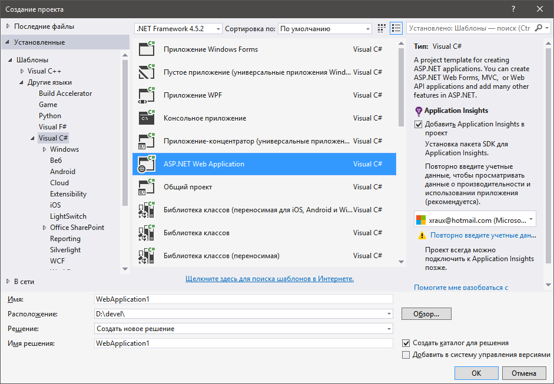
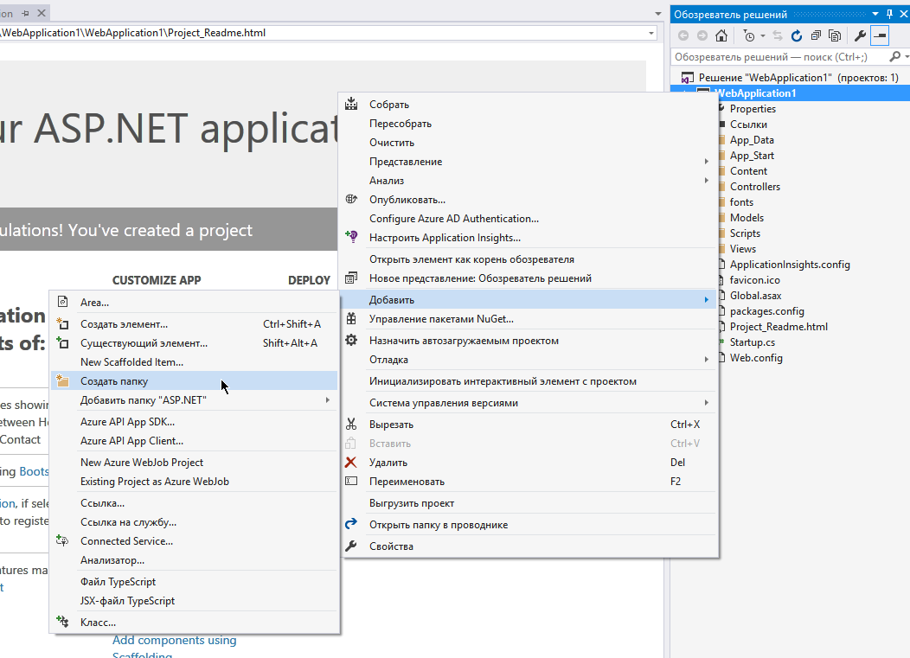
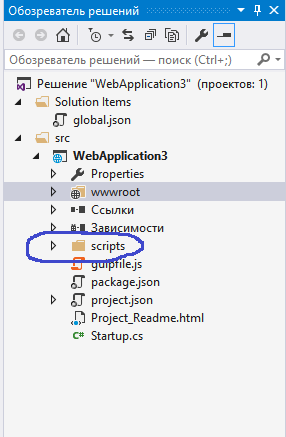
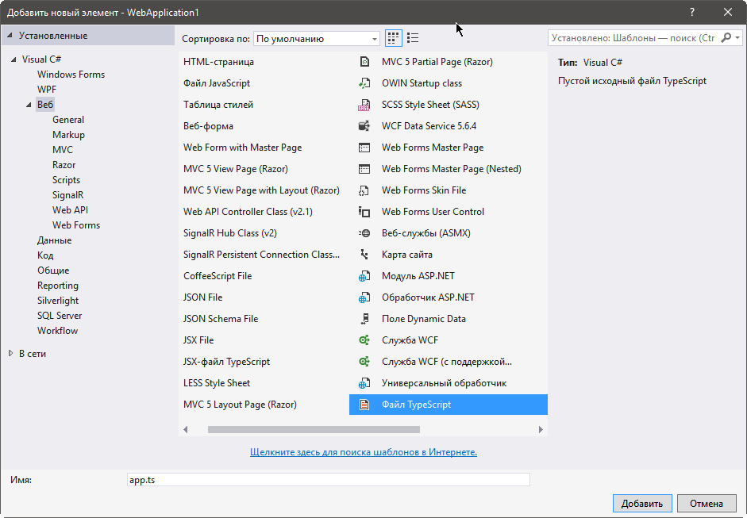
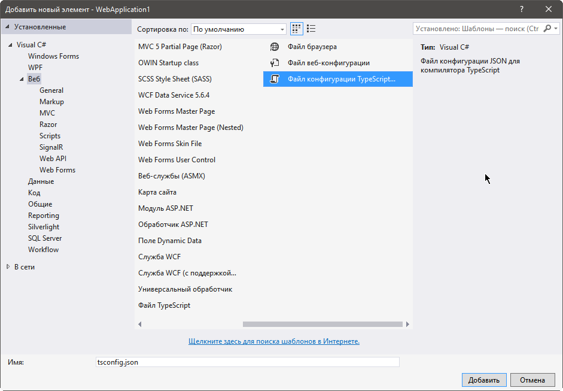
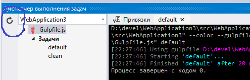
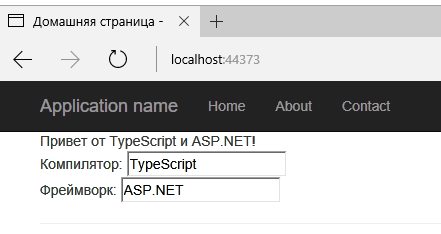

# Настройка

## Установка ASP.NET Core и TypeScript

Сначала [установите ASP.NET Core](https://get.asp.net), если это необходимо.
В данном руководстве используется Visual Studio, что означает, что для использования ASP.NET Core вам понадобится Visual Studio 2015.

Если в вашей версии Visual Studio еще нет TypeScript, [установите его для Visual Studio 2015](http://www.microsoft.com/en-us/download/details.aspx?id=48593).

## Создание нового проекта

1. Выберите **Файл** (**File**)
2. Выберите **Создать проект** (**New Project**) (Ctrl + Shift + N)
3. Выберите **Visual C#**
4. Выберите **ASP.NET Web Application**

   

5. Выберите **ASP.NET 5 Empty**

   Флажок "Разместить в облаке" ("Host in the cloud") здесь снят, так как это пример локального проекта.
   

Запустите приложение, и убедитесь, что оно работает.

## Настройка сервера

В файле `project.json` добавьте к `"dependencies"` следующий элемент:

```json
"Microsoft.AspNet.StaticFiles": "1.0.0-rc1-final"
```

В результате должен получиться подобный список зависимостей:

```json
  "dependencies": {
    "Microsoft.AspNet.IISPlatformHandler": "1.0.0-rc1-final",
    "Microsoft.AspNet.Server.Kestrel": "1.0.0-rc1-final",
    "Microsoft.AspNet.StaticFiles": "1.0.0-rc1-final"
  },
```

В файле `Startup.cs` замените тело `Configure` на следующее:

```cs
public void Configure(IApplicationBuilder app)
{
    app.UseIISPlatformHandler();
    app.UseDefaultFiles();
    app.UseStaticFiles();
}
```

# Добавление TypeScript

Следующий шаг — добавить папку для TypeScript.



Назовем ее `scripts`.



## Добавление кода TypeScript

Щелкните правой кнопкой на `scripts` и выберите **Создать элемент** (**New Item**).
Затем выберите **Файл TypeScript** (**TypeScript File**) (этот пункт может находиться в разделе .NET Core), и назовите файл `app.ts`.



## Добавление кода примера

Введите следующий код в `app.ts`.

```ts
function sayHello() {
    const compiler = (document.getElementById("compiler") as HTMLInputElement).value;
    const framework = (document.getElementById("framework") as HTMLInputElement).value;
    return `Привет от ${compiler} и ${framework}!`;
}
```

## Настройка сборки

### Настройка компилятора TypeScript

Для начала нужно объяснить компилятору TypeScript, как собирать проект.
Щелкните правой кнопкой мыши на папке `scripts` и выберите **Создать элемент** (**New Item**).
Затем выберите **Файл конфигурации TypeScript** (**TypeScript Configuration File**), и используйте имя по умолчанию `tsconfig.json`.



Замените содержимое файла `tsconfig.json`, которое было по умолчанию, на следующее:

```json
{
  "compilerOptions": {
      "noImplicitAny": true,
      "noEmitOnError": true,
      "sourceMap": true,
      "target": "es5",
  },
  "files": [
      "./app.ts"
  ],
  "compileOnSave": true
}
```

Это похоже на то, что было по умолчанию, но отличается следующим:

1. Устанавливается `"noImplicitAny": true`.
2. Явно перечисляются входные файлы в `"files"`, не полагаясь на `"excludes"`.
4. Устанавливается `"compileOnSave": true`.

Указывать `"noImplicitAny"` — неплохая идея, если вы пишете новый код; это поможет удостовериться, что вы по ошибке не напишете нетипизированный код.
`"compileOnSave"` упрощает обновление кода в запущенном веб-приложении.

### Настройка NPM

Теперь нужно настроить NPM, чтобы загружать JavaScript-пакеты.
Щелкните правой кнопкой мыши на проекте и выберите **Создать элемент** (**New Item**).
Затем выберите **Файл конфигурации NPM** (**NPM Configuration File**) и используйте имя по умолчанию `package.json`.
Добавьте "gulp" и "del" в `"devDependencies"`:

```json
"devDependencies": {
    "gulp": "3.9.0",
    "del": "2.2.0"
}
```

Visual Studio начнет устанавливать gulp и del, как только вы сохраните файл.
Если этого не происходит, щелкните правой кнопкой мыши по `package.json` и выберите **Восстановить пакеты** (**Restore Packages**).

### Настройка gulp

Теперь добавьте новый файл JavaScript под именем `gulpfile.js`.
Вставьте в него следующий код:

```js
/// <binding AfterBuild='default' Clean='clean' />
/*
Данный файл является главной точкой входа для объявления задач Gulp и
использования плагинов. Щелкните здесь, чтобы узнать больше.
http://go.microsoft.com/fwlink/?LinkId=518007
*/

var gulp = require('gulp');
var del = require('del');

var paths = {
    scripts: ['scripts/**/*.js', 'scripts/**/*.ts', 'scripts/**/*.map'],
};

gulp.task('clean', function () {
    return del(['wwwroot/scripts/**/*']);
});

gulp.task('default', function () {
    gulp.src(paths.scripts).pipe(gulp.dest('wwwroot/scripts'))
});
```

Первая строка приказывает Visual Studio запустить задачу `default` после завершения сборки.
Кроме этого, при очистке проекта будет запускаться задача `clean`.

Теперь щелкните правой кнопкой мыши по файлу `gulpfile.js` и выберите **Диспетчер выполнения задач** (**Task Running Explorer**).
Если задачи под названиями 'default' и 'clean' не появляются, обновите диспетчер:



## Написание HTML страницы

Добавьте новый элемент под именем `index.html` в папку `wwwroot`.
В качестве кода для него используйте:

```html
<!DOCTYPE html>
<html>
<head>
    <meta charset="utf-8" />
    <script src="scripts/app.js"></script>
    <title></title>
</head>
<body>
    <div id="message"></div>
    <div>
        Компилятор: <input id="compiler" value="TypeScript" onkeyup="document.getElementById('message').innerText = sayHello()" /><br />
        Фреймворк: <input id="framework" value="ASP.NET" onkeyup="document.getElementById('message').innerText = sayHello()" />
    </div>
</body>
</html>
```

## Тестирование

1. Запустите проект.
2. При изменении полей ввода вы должны увидеть сообщение:



## Отладка

1. Нажмите F12 в браузере Edge и выберите вкладку **Отладчик** (**Debugger**).
2. Откройте первую папку `localhost`, затем `src/app.ts`.
3. Поставьте точку останова на строку с `return`.
4. Заполните поля ввода и убедитесь, что точка останова срабатывает на TypeScript-коде, и все работает правильно.


Это все, что нужно знать, чтобы применить TypeScript в проекте ASP.NET.
Дальше мы задействуем Angular и напишем простое приложение для этого фреймворка.

# Добавление Angular 2

## Загрузка зависимостей из NPM

Чтобы установить Angular 2 и SystemJS, добавьте следующие элементы к `"dependencies"` в файле `package.json`:

```json
  "dependencies": {
    "angular2": "2.0.0-beta.11",
    "systemjs": "0.19.24",
  },
```

## Установка файлов объявлений для зависимостей

Библиотека es6-shim включена в Angular для поддержки обещаний, но TypeScript все же нужны файлы объявлений для нее.
Откройте командную строку, затем измените текущую директорию на директорию с исходными файлами:

```shell
cd C:\Users\<имя_пользователя>\Documents\Visual Studio 2015\Projects\<app>\src\<app>
npm install -g typings
typings install --global dt~es6-shim
```

## Обновление tsconfig.json

Теперь, когда Angular 2 и его зависимости установлены, нужно включить в TypeScript экспериментальную поддержку декораторов, а также включить в код объявления типов для es6-shim.
В будущем декораторы и ES6 будут включены по умолчанию и данные настройки станут не нужны.
Добавьте `"experimentalDecorators": true, "emitDecoratorMetadata": true` в `"compilerOptions"`, и `"./typings/index.d.ts"` в `"files"`.
В последнюю очередь нужно добавить в `"files"` новый элемент для файла `"./src/model.ts"`, который мы создадим.
Файл `tsconfig.json` теперь должен быть таким:

```json
{
  "compilerOptions": {
      "noImplicitAny": true,
      "noEmitOnError": true,
      "sourceMap": true,
      "experimentalDecorators": true,
      "emitDecoratorMetadata": true,
      "target": "es5"
  },
  "files": [
      "./app.ts",
      "./model.ts",
      "./main.ts",
      "../typings/main.d.ts"
  ],
  "compileOnSave": true
}
```

## Добавление Angular к сборке с gulp

Теперь нужно убедиться, что файлы Angular будут копироваться во время сборки.
Нужно добавить:

1. Пути к библиотечным файлам.
2. Задачу `lib`, чтобы направить файлы в `wwwroot`.
3. Зависимость от `lib` к задаче `default`.

Измененный файл `gulpfile.js` должен выглядеть так:

```xml
/// <binding AfterBuild='default' Clean='clean' />
/*
Данный файл является главной точкой входа для объявления задач Gulp и
использования плагинов. Щелкните здесь, чтобы узнать больше.
http://go.microsoft.com/fwlink/?LinkId=518007
*/

var gulp = require('gulp');
var del = require('del');

var paths = {
    scripts: ['scripts/**/*.js', 'scripts/**/*.ts', 'scripts/**/*.map'],
    libs: ['node_modules/angular2/bundles/angular2.js',
           'node_modules/angular2/bundles/angular2-polyfills.js',
           'node_modules/systemjs/dist/system.src.js',
           'node_modules/rxjs/bundles/Rx.js']
};

gulp.task('lib', function () {
    gulp.src(paths.libs).pipe(gulp.dest('wwwroot/scripts/lib'))
});

gulp.task('clean', function () {
    return del(['wwwroot/scripts/**/*']);
});

gulp.task('default', ['lib'], function () {
    gulp.src(paths.scripts).pipe(gulp.dest('wwwroot/scripts'))
});
```

Как и в прошлый раз, убедитесь, что после сохранения `gulpfile.js` Диспетчер выполнения задач увидел новую задачу `lib`.

## Написание простого Angular-приложения на TypeScript

Для начала измените код в `app.ts` на следующий:

```ts
import {Component} from "angular2/core"
import {MyModel} from "./model"

@Component({
    selector: `my-app`,
    template: `<div>Привет от {{getCompiler()}}</div>`
})
class MyApp {
    model = new MyModel();
    getCompiler() {
        return this.model.compiler;
    }
}
```

Затем добавьте еще один файл TypeScript под именем `model.ts` в папку `src`.

```ts
export class MyModel {
    compiler = "TypeScript";
}
```

И файл `main.ts` в `src`:

```ts
import {bootstrap} from "angular2/platform/browser";
import {MyApp} from "./app";
bootstrap(MyApp);
```

Теперь измените код в `index.html` на следующий:

```html
<!DOCTYPE html>
<html>
<head>
    <meta charset="utf-8" />
    <script src="scripts/lib/angular2-polyfills.js"></script>
    <script src="scripts/lib/system.src.js"></script>
    <script src="scripts/lib/rx.js"></script>
    <script src="scripts/lib/angular2.js"></script>
    <script>
    System.config({
        packages: {
            'scripts': {
                format: 'cjs',
                defaultExtension: 'js'
            }
        }
    });
    System.import('scripts/main').then(null, console.error.bind(console));
    </script>
    <title></title>
</head>
<body>
    <my-app>Загрузка...</my-app>
</body>
</html>
```

Этот код загружает приложение.
При запуске приложения ASP.NET должен появиться элемент `div` с текстом "Загрузка...", который затем изменяется на "Привет от TypeScript".
